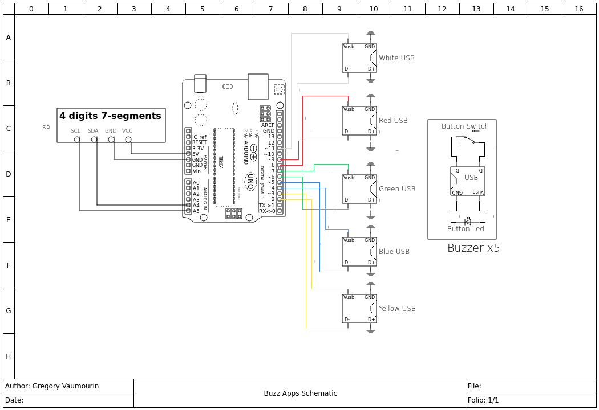

# Buzzer App 

A small blind test arcade game. 
Several games are implemented on top of this: 
    - A blind test game: a script is also provided to create a blindtest round, go to assets/blindtest for examples
    - A quiz game: go to assets/quiz for examples 

# Description 

The project is composed of several parts: 
    - The arduino board
    - The python server 
    - The web interface

## The arduino board 

I have used an arduino board, but you can use any board that you have available. 
The board handles 5 push buttons, 5 button leds and 5 7-digits to keep the score
A small protocol is used on top of a serial connection to handle Arduino events
The program here is static and is kept agnostic from the game mode.

## The python server 

The python server acts as the back-end of the game.
It centralized the information about the game and take decision.  
    - It handles serial messages coming from the Arduino board, set the leds and the score, and handle push buttons pressed
    - It runs a websocket server that the game master interface connects to  

## The game master interface 

The game master interface:  allows to configure and launch a game 
It is done as a simple HTML/JS page 
The format to create quiz or blindtest rounds can be found in the assets subfolder

# Electronic

Parts needed for the project: 
- 5 arcade button
- 10 USB-A female port
- 5 USB-A males to male cables 
- 1 Arduino Uno
- 5 4-digits 7-segments with i2c interfaces

Connections are pretty straigthforward 

I have decided to connect the buzzer with USB, as it uses 4 pins, which is just what I need to connect a arcade button, 2 pins for the button switches and 2 for the button led. The buzzers can be plug and unplugged with ease.

The 7-segments displays are connected to the Arduino with an I2C interface, each display having a different I2C address. It uses the HT16k33 module to translate the I2C message to 7-segments configuration. 

# Software Installation

For the Python server, there are dependencies
``pip install websocket_server termios tty select serial json``

# Running 

1) Flash the arduino code and connect it to a laptop
2) Launch the python server, there is an optional parameter to indicate the tty device 
note that there is also an interactive mode for testing purposing that does not require the arduino board to be connected
3) Open the web page with a browser, it should mention ``Connected to the websocket server``